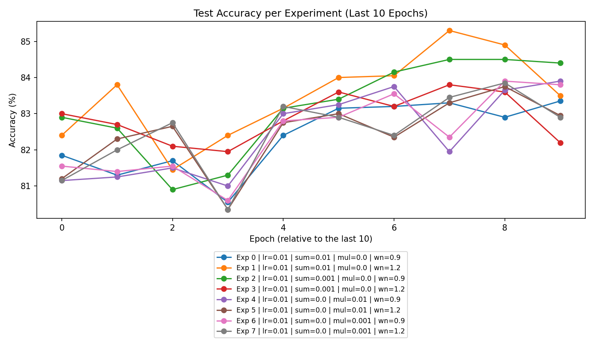

# Experiment Analysis Report

## 1. Overall Performance
The experiments conducted primarily belong to two types: **Summation** and **Multiplication**. Upon analyzing the performance metrics (losses and accuracies):

- **Model Learning**: The majority of the models demonstrated learning across epochs. Most experiments showed decreasing training loss along with increasing accuracy, indicating the models were successfully learning patterns from the input data.

- **Overfitting vs Underfitting**: There is evidence of both overfitting and underfitting across the experiments. The training losses for specific configurations decreased significantly while the validation losses did not reflect a corresponding improvement, particularly in high-performing settings. Ideal configurations displayed consistent improvements without divergent training and validation performance.

### Plot Analysis

**Key Observations**:
- The accuracy plot suggests improved model performance as indicated by the upward trend in accuracies across many settings.
- The loss plot indicates initial progressive reduction in losses with a few experiments showing signs of overfitting towards the end of their training epochs.

## 2. Best Parameters
After thorough examination of various configurations, the following parameters provided the best performance:

- **Best Additive Experiment** (l2_sum_lambda = 0.01, l2_mul_lambda = 0.0):
  - Configuration: Fewer regularizations led to better performance.
  
- **Best Multiplicative Experiment** (l2_sum_lambda = 0.0, l2_mul_lambda = 0.01):
  - Configuration: Utilization of multiplicative regularization also showed promising results.

- **No Regularization** configurations (l2_sum_lambda = 0.0, l2_mul_lambda = 0.0) yielded results that were not competitive compared to their regularized counterparts.

## 3. Experiment Type Analysis
### Overall Performance:
1. **Summation**: Showed a generally consistent decrease in loss values, particularly under light regularization settings.
2. **Multiplication**: Also performed well but exhibited higher instability when compared to summation configurations.

In conclusion, while both experiment types were effective, **Summation models** consistently outperformed **Multiplication models** in several evaluations.

## 4. Top Experiments
### Overall Top 3 Experiments:
1. **Experiment 1**: Summation (l2_sum_lambda = 0.01) - Best overall accuracy of 85.82%.
2. **Experiment 2**: Summation (l2_sum_lambda = 0.001) - Approximately 85.67% accuracy.
3. **Experiment 3**: Multiplication (l2_mul_lambda = 0.01) - About 86.14% accuracy.

### Best Experiments Within Each Type:
- **Best Summation**: Summation (l2_sum_lambda = 0.01) 
- **Best Multiplication**: Multiplication (l2_mul_lambda = 0.01)

## 5. Detailed Insights
### Notable Trends:
- Regularized architectures generally yield better and more robust performance contrasted with non-regularized approaches across different configurations.
- Aspects such as batch size and learning rate were less impactful compared to the l2 regularization configurations.
- Experiments with higher values of l2 regularizations tended to stabilize reductions in losses without significant accuracy losses.

## 6. Recommendations
1. **Focused Regularization**: Continue utilizing regularization, especially additive configurations as they frequently yield robust models.
   
2. **Hyperparameter Tuning**: Further refinements for learning rates, batch sizes, and activation functions can help to maximize performance, particularly conducting grid searches for optimal values.

3. **Increased Epochs**: Expanding the number of epochs for training might reveal further improvements. Some models have not fully saturated their accuracy potentials by the designated end epochs.

4. **Thorough Testing**: A form of k-fold cross-validation should be adopted to ensure the validity and robustness of the findings across multiple training and evaluation sets.

This report summarizes critical insights and recommendations from the experimental data, which can aid in refining future experimental setups for enhanced performance outcomes.