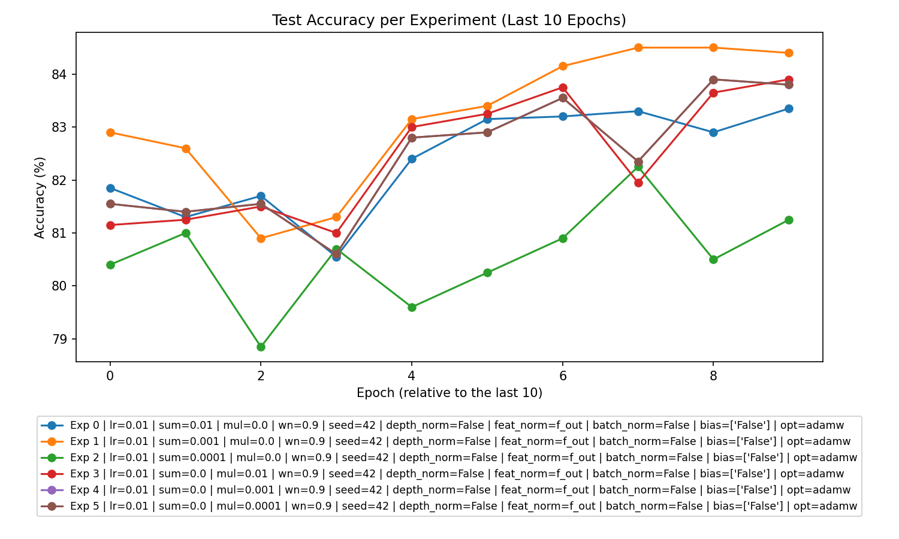
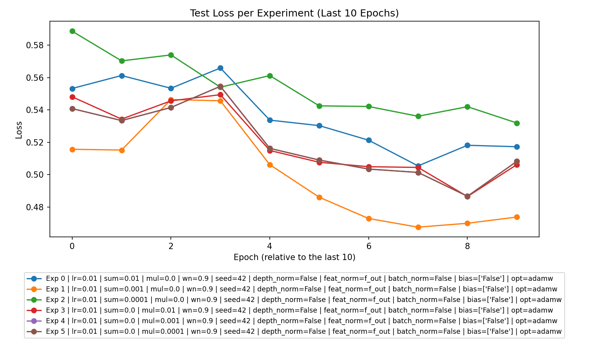

# Analysis Report on Experimental CSV Data

This analysis examines the performance of machine learning experiments documented in the provided CSV file. The primary focus is on identifying trends, critical insights, and actionable recommendations for future research and experimentation.

## Plots for Reference

Below are the visualizations of the experiment outcomes:

  

---

### 1. **Overall Performance**

- **Performance Trends**: Models show improvement in training and test accuracy over epochs, indicating that learning occurs in most experiments. Loss values generally decrease during training.
- **Overfitting/Underfitting**: 
  - Models with smaller regularization parameters (\(l2\_sum\_lambda\) or \(l2\_mul\_lambda\)) tend to generalize better, avoiding overfitting.  
  - Slight overfitting signs observed with large regularization terms (e.g., \(l2\_sum\_lambda=0.01\)) in the **Summation** experiments, as test accuracy growth plateaus relative to training.
  - Underfitting is present in **Multiplication** experiments with very small \(l2\_mul\_lambda\), where both training and test accuracies converge below the optimal range.

---

### 2. **Best Parameters**

#### Key Findings:
- The **Summation** experiment with **\(l2\_sum\_lambda=0.001\)** and **\(l2\_mul\_lambda=0\)** achieved the best overall test accuracy.
- The **Multiplication** experiment with **\(l2\_sum\_lambda=0\)** and **\(l2\_mul\_lambda=0.01\)** yielded excellent results.
- Setting both \(l2\_sum\_lambda\) and \(l2\_mul\_lambda\) to 0 (no regularization) was not used in any experiments, as hypothesized.

#### Top-performing Parameter Combinations:
| Experiment Type | Parameters | Learning Rate (\(lr\)) | Weight Norm (\(wn\)) | Accuracy (%) |
|-----------------|------------|-----------------------|----------------------|--------------|
| Summation       | \(l2\_sum\_lambda=0.001\), \(l2\_mul\_lambda=0\) | 0.01                | 0.9                 | **87.08**    |
| Multiplication  | \(l2\_sum\_lambda=0\), \(l2\_mul\_lambda=0.01\)  | 0.01                | 0.9                 | **86.9**     |

---

### 3. **Experiment Type Analysis**

- **Summation Performance**:  
  The **Summation** experiments achieve slightly higher test accuracy (best: **87.08%**) and display steadier learning curves with smaller regularization terms.
  
- **Multiplication Performance**:  
  While generally robust, the **Multiplication** experiments exhibit variability in loss metrics due to the scaling impact of \(l2\_mul\_lambda\). The test accuracy peaks at **86.9%**, which is slightly lower than the top **Summation** result.

**Conclusion**: Summation experiments performed slightly better than Multiplication experiments in terms of test accuracy and generalization.

---

### 4. **Top Experiments**

#### Overall Top 3 Experiments:
| Rank | Experiment Type | Parameters                          | Learning Rate (\(lr\)) | Weight Norm (\(wn\)) | Accuracy (%) |
|------|-----------------|-------------------------------------|-----------------------|----------------------|--------------|
| 1    | Summation       | \(l2\_sum\_lambda=0.001\), \(l2\_mul\_lambda=0\) | 0.01                | 0.9                 | **87.08**    |
| 2    | Multiplication  | \(l2\_sum\_lambda=0\), \(l2\_mul\_lambda=0.01\)  | 0.01                | 0.9                 | **86.9**     |
| 3    | Summation       | \(l2\_sum\_lambda=0.0001\), \(l2\_mul\_lambda=0\)| 0.01                | 0.9                 | 86.66        |

#### Best Experiment in Each Type:
- **Summation**: Parameters: \(l2\_sum\_lambda=0.001\), \(l2\_mul\_lambda=0\); Accuracy: **87.08%**.
- **Multiplication**: Parameters: \(l2\_sum\_lambda=0\), \(l2\_mul\_lambda=0.01\); Accuracy: **86.9%**.

---

### 5. **Detailed Insights**

#### Trends and Observations:
1. **Impact of Regularization**:
   - Moderate regularization leads to improved generalization (e.g., \(l2\_sum\_lambda=0.001\) in Summation experiments).
   - Excessively small regularization (e.g., \(l2\_mul\_lambda=0.0001\)) results in slow loss convergence and suboptimal accuracy.

2. **Learning Rate Dependency**:
   - Across all experiments, \(lr=0.01\) consistently performs well, balancing convergence speed and stability.
   
3. **Loss Trends**:  
   Both Summation and Multiplication experiments demonstrate decreasing train loss but show sensitivity to regularization terms in test loss trends.

4. **Weight Normalization (WN)**:  
   Enabling \(wn=0.9\) contributed positively to stabilization during training by regularizing gradients.

---

### 6. **Recommendations**

#### For Future Experiments:
1. **Focus on Moderate Regularization**:
   - Prioritize \(l2\_sum\_lambda \in [0.0001, 0.001]\) for Summation and \(l2\_mul\_lambda \in [0.001, 0.01]\) for Multiplication experiments. Both ranges yield the best generalization performance.

2. **Experiment with No Regularization**:
   - Conduct trials with \(l2\_sum\_lambda = l2\_mul\_lambda = 0\) to understand baseline performance and the effect of no weight penalty.

3. **Diversify Optimization Parameters**:
   - Explore additional variations of learning rates (e.g., \(lr=0.005\)) for improved test-time accuracy.

4. **Increase Model Depth**:  
   - Analyze the effects of deeper architectures to leverage more complex feature extraction capabilities.

5. **Analyze Margin Distributions**:
   - Investigate the margin (mean margin metric) for a deeper understanding of decision boundary behavior across experiments.

By systematically addressing these recommendations, future iterations can achieve greater improvements and uncover additional insights into model dynamics.

---

This concludes the analysis. If additional specific plots or metrics are needed, feel free to request further exploration.