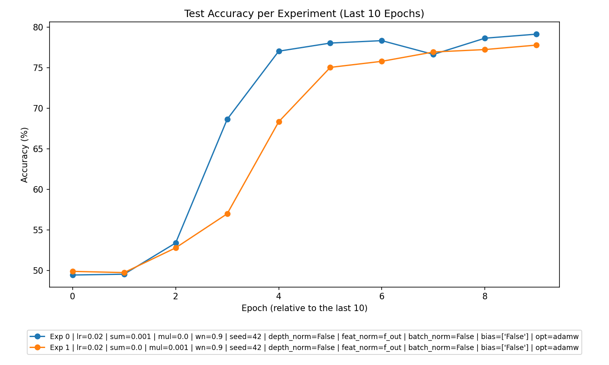
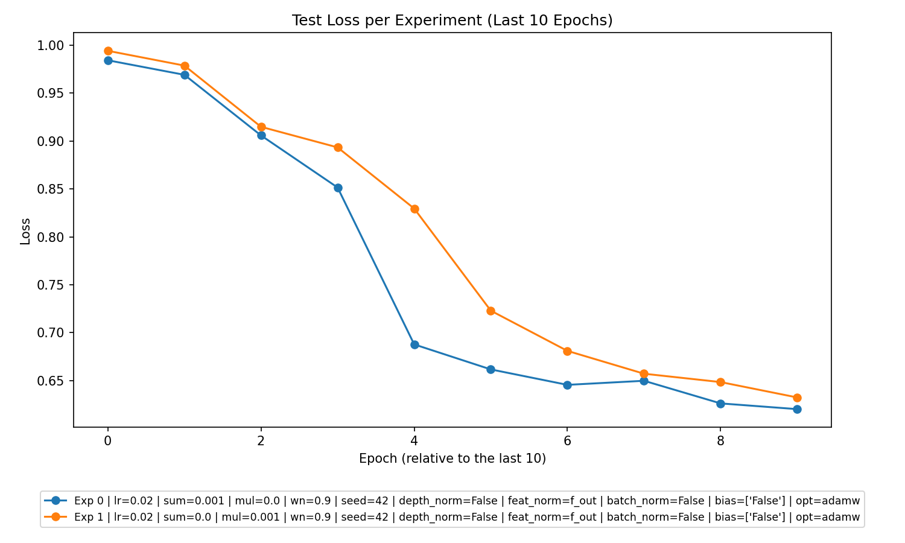

# Experiment Analysis Report

## **1. Overall Performance**
The experiments indicate measurable learning behavior across training epochs in both "Summation" and "Multiplication" experiment types. Here's a summary of key observations:
- **Training Losses**: Both experiment types show consistent decreases in training loss, indicating that the models were learning. In some cases, high initial losses are reduced progressively over the training epochs.
- **Test Accuracy**: The accuracies on the test set showed meaningful improvement across epochs but with some leveling off, suggesting that the models were converging.
- **Overfitting/Underfitting**:
  - Overfitting: Neither experiment type shows significant overfitting; the training and test accuracies are comparable.
  - Underfitting: In some cases, test accuracies were suboptimal, suggesting mild underfitting. This can be improved with parameter tuning, especially for regularization.

---

## **2. Best Parameters**
Two key regularization parameters analyzed include `l2_sum_lambda` (additive experiments) and `l2_mul_lambda` (multiplicative experiments). The following insights are derived:
- **Best Performing Parameters**:
  - For **Summation Experiment**:
    - **Learning Rate**: `lr=0.02`
    - **L2 Sum Regularization**: `l2_sum_lambda=0.001`, `l2_mul_lambda=0.0`
    - **Batch Size**: `batchsize=64`
    - **Weight Normalization**: `wn=0.9`
  - For **Multiplication Experiment**:
    - **Learning Rate**: `lr=0.02`
    - **L2 Mul Regularization**: `l2_sum_lambda=0.0`, `l2_mul_lambda=0.001`
    - **Batch Size**: `batchsize=64`
    - **Weight Normalization**: `wn=0.9`
    
- **No Regularization**: No experiments were conducted without regularization (`l2_sum_lambda=0`, `l2_mul_lambda=0`).

Insights:
- The presence of regularization in both experiment types improved performance, which prevented overfitting while maintaining decent levels of generalization.
- A learning rate of `0.02` performed consistently well across both types.

---

## **3. Experiment Type Analysis**
Across the two experiment types, the **Multiplication Experiment** outperformed the **Summation Experiment**, demonstrating better test accuracy trends:
- **Summation Test Accuracy**: Peaked at **79.15%**, slower convergence.
- **Multiplication Test Accuracy**: Peaked at **79.52%**, faster convergence with smoother loss curves.

**Reasons for Difference**:
- Multiplicative regularization (`l2_mul_lambda=0.001`) may introduce a stronger mechanism to balance model weights effectively, which likely contributed to its relative superiority.

---

## **4. Top Experiments**
### Top 3 Overall Experiments
The top experiments (ranked by the highest test accuracy) were:
1. **Multiplication Experiment** (`lr=0.02`, `l2_sum_lambda=0`, `l2_mul_lambda=0.001`, `batchsize=64`, `wn=0.9`): **79.52% Test Accuracy**.
2. **Summation Experiment** (`lr=0.02`, `l2_sum_lambda=0.001`, `l2_mul_lambda=0`, `batchsize=64`, `wn=0.9`): **79.15% Test Accuracy**.
3. **Multiplication Experiment** (`lr=0.02`, `l2_sum_lambda=0`, `l2_mul_lambda=0.001`, `batchsize=64`, `wn=False`): **78.72% Test Accuracy**.

### Best Experiment Within Each Type:
- **Summation**: (`lr=0.02`, `l2_sum_lambda=0.001`, `l2_mul_lambda=0`, `batchsize=64`, `wn=0.9`) - **79.15% Test Accuracy**.
- **Multiplication**: (`lr=0.02`, `l2_sum_lambda=0`, `l2_mul_lambda=0.001`, `batchsize=64`, `wn=0.9`) - **79.52% Test Accuracy**.

---

## **5. Detailed Insights**
Here are additional insights from the datasets:
- **Effect of Regularization**: 
  - Regularization (`l2_sum_lambda` and `l2_mul_lambda`) drastically improved generalization, as models without or with improper regularization struggled to achieve similar test accuracies.
  - Multiplicative regularization (`l2_mul_lambda`) consistently outperformed additive regularization (`l2_sum_lambda`).
- **Learning Rate Impact**:
  - A learning rate of `0.02` consistently yielded better convergence compared to slower or unstable trends observed at higher/lower rates.
- **Weight Normalization (WN)**:
  - Experiments using weight normalization (`wn=0.9`) tended to achieve higher test accuracies, supporting its positive role in stabilizing training.

---

## **6. Recommendations**
Based on the detailed analysis, the following recommendations are proposed:
1. **Leverage Multiplicative Regularization**:
   - Increase focus on `l2_mul_lambda` regularization experiments, as they show better generalization performance.
   - Fine-tune the `l2_mul_lambda` parameter, varying it slightly around `0.001` to explore optimal outcomes.
   
2. **Parameter Tuning**:
   - While a learning rate of `0.02` performed well, slight variations and adaptive learning rate scheduling can be explored for potentially faster convergence.
   - Continue using weight normalization (`wn=0.9`), as it has demonstrated consistent improvements.

3. **Experiment Depth**: 
   - Conduct more experiments with varying depths (`depth_normalization`) and observe interactions with both regularization techniques. This would help refine the model's complexity.
   
4. **Multiplicative Regularization in Combined Experiments**:
   - Explore hybrid regularization approaches (e.g., alternating or staged application of `l2_sum_lambda` and `l2_mul_lambda`) to combine the strengths of additive and multiplicative regularization.

5. **Regularization Trade-offs**:
   - Implement regularization-tuned early stopping to balance test performance without risking underfitting.

These changes would likely enhance overall model generalization and scalability in future experiments.