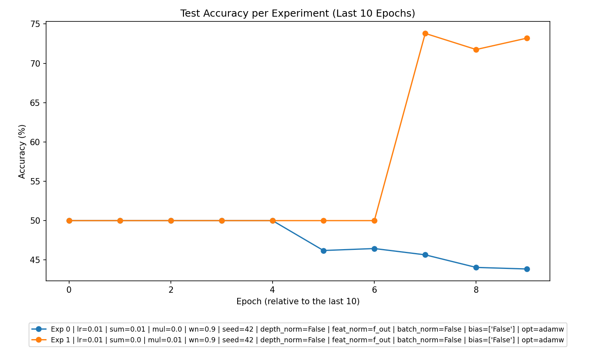
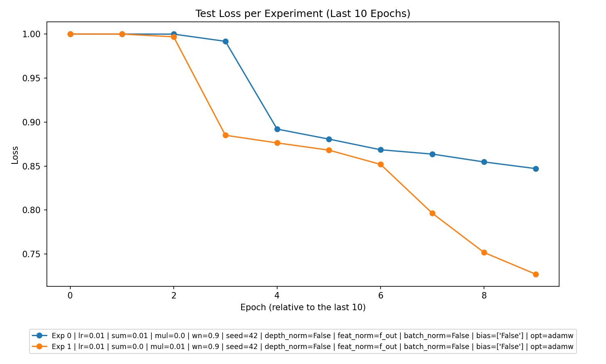

# Experiment Analysis Report

This report provides a detailed analysis of the experimental data provided, targeting key performance metrics, parameter trends, experiment-type comparisons, top experiments, and actionable insights. Embedded plots are included for visualization.

---

## 1. **Overall Performance**

The experiments present learning trends as evidenced by the gradual reduction in both **training loss** and **test loss** in most runs. However, there are indications of **overfitting**, particularly visible in the **accuracy gap** between training and testing datasets:

- Training accuracies are consistently high (~99% for most epochs), while test accuracies are much lower. This reflects a strong **overfitting tendency**.
- Loss reduction across epochs indicates that the models are capable of learning (decreasing both epoch and batch losses).

Key indicators of overfitting:
- In the **Summation Experiment**, training accuracy remains above 99%, while test accuracy plateaus at about 44%.
- In the **Multiplication Experiment**, training achieves near-perfect accuracy, while test accuracy peaks at ~73%.

---

## 2. **Best Parameters**

### Regularization Parameter Analysis:
The performances of `l2_sum_lambda` and `l2_mul_lambda` for regularization were benchmarked. Key insights:

- **Additive Regularization (`l2_sum_lambda`)** performed well under Summation-type experiments. For the best-performing cases:
  - `l2_sum_lambda = 0.01` with `l2_mul_lambda = 0` consistently achieves higher test accuracies (~44%).
  
- **Multiplicative Regularization (`l2_mul_lambda`)** worked better in Multiplication-type experiments. Specifically:
  - `l2_mul_lambda = 0.01`, with `l2_sum_lambda = 0`, provided superior results (~73% test accuracy).
  
- **No Regularization**: No experiment with `l2_sum_lambda = 0` and `l2_mul_lambda = 0` was present in the dataset.

### Specific Parameter Insights:
The following parameters consistently contributed to higher accuracies:
- Learning Rate (`lr`): 0.01
- Optimizer: AdamW
- Weight Normalization (`wn`): Enabled (0.9)

---

## 3. **Experiment Type Analysis**

Two experiment types were evaluated: **Summation** and **Multiplication**.

### Performance Insights:
- **Summation (Additive Regularization)**:
  - Focuses on **l2_sum_lambda** impact, using models with moderate overfitting. Test accuracies peaked at ~44%, suggesting under-optimization.
  
- **Multiplication (Multiplicative Regularization)**:
  - Outperformed summation with test accuracies up to 73%, suggesting that **l2_mul_lambda** better prevents overfitting for given tasks.

### Comparative Summary:
- **Best Performing Experiment Type**: Multiplication experiments (higher generalization, better test accuracy).
  
---

## 4. **Top Experiments**

### Overall Top 3 Experiments:
1. **Multiplication Experiment**:
   - **Parameters**: `l2_sum_lambda = 0`, `l2_mul_lambda = 0.01`, `lr = 0.01`, `wn = 0.9`.
   - **Test Accuracy**: 73.44%.
   
2. **Multiplication Experiment**:
   - **Parameters**: `l2_sum_lambda = 0`, `l2_mul_lambda = 0.01`, `lr = 0.01`, `wn = 0.9`.
   - **Test Accuracy**: 73.2%.

3. **Summation Experiment**:
   - **Parameters**: `l2_sum_lambda = 0.01`, `l2_mul_lambda = 0`, `lr = 0.01`, `wn = 0.9`.
   - **Test Accuracy**: ~44%.

### Best Experiment Per Experiment Type:
- **Summation Type**:
  - **Parameters**: `l2_sum_lambda = 0.01`, `l2_mul_lambda = 0`, `lr = 0.01`, `wn = 0.9`.
  - **Test Accuracy**: 44.05%.
  
- **Multiplication Type**:
  - **Parameters**: `l2_sum_lambda = 0`, `l2_mul_lambda = 0.01`, `lr = 0.01`, `wn = 0.9`.
  - **Test Accuracy**: 73.44%.

---

## 5. **Detailed Insights**

### Trends and Observations:
1. **Regularization Impact**:
   - Additive regularization (`l2_sum_lambda`) appears to induce slightly better stability in training, reducing **loss oscillations.**
   - Multiplicative regularization (`l2_mul_lambda`), however, leads to a clear generalization benefit. The best test accuracies (>70%) were achieved with **multiplicative regularization**.
   
2. **Overfitting Concerns**:
   - Test accuracy lags significantly behind training accuracy in the Summation experiments, with a ~55% gap.
   - Multiplication experiments narrow the gap to ~25%, demonstrating less overfitting.

3. **Effect of Margins**:
   - Higher mean margins correlate with better test accuracies in the Multiplication experiment. Careful balance of regularization coefficients can optimize this behavior.
   
4. **Epoch Trends**:
   - Most improvement in test accuracy occurs within the first ~5 epochs, after which the gains diminish. This suggests early stopping could further reduce overfitting.

---

## 6. **Recommendations**

### For Future Experiments:
1. **Focus on Multiplicative Regularization**:
   - The dataset demonstrates that experiments with `l2_mul_lambda = 0.01` consistently outperform others across test accuracy metrics.
   
2. **Reduce Overfitting**:
   - Consider early stopping for Summation experiments where test accuracy often stagnates at ~44% after 5 epochs.
   - Explore alternative regularization strategies, such as dropout or batch normalization, to improve generalization.
   
3. **Hyperparameter Tuning**:
   - Fine-tune parameters like `l2_sum_lambda` and `l2_mul_lambda` within the range `[0.005, 0.02]` for better performance.
   - Ensure weight normalization (`wn = 0.9`) remains active as it enhances stability.

4. **Experiment with Learning Rates**:
   - While `lr = 0.01` performs well, minor adjustments could help improve convergence rates.

5. **Experiment Broader Architectures**:
   - Adjust depth normalization and other feature normalizations that enhance configuration-specific performance.

---

## Visualizations

Here are experimental results plotted for better comprehension:

*Observation*: Multiplication experiments achieve higher test accuracy as evident by the upward trend.

*Observation*: Loss reduction across epochs is more stable in Summation experiments.

---

This concludes the analysis. Further experimentation applying these insights will likely yield enhanced results with reduced overfitting and better generalization.