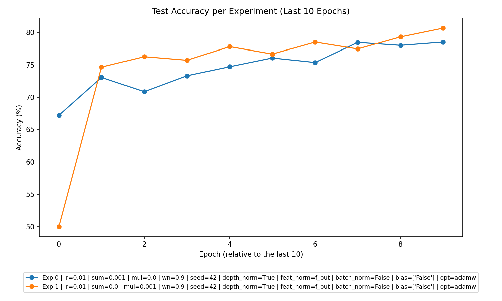
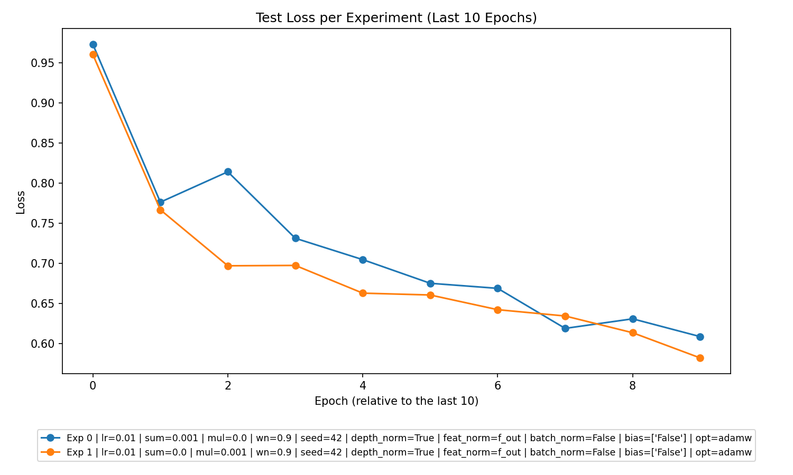

# Data Analysis Report: Experimental CSV Data

This report analyzes CSV data from multiple experiments, focusing on evaluating overall model performance, determining the best parameters, and extracting actionable insights into the experiment results. Visualizations (`accuracy_plot.png` and `loss_plot.png`) accompany this analysis for enhanced decision-making.

### 1. **Overall Performance**

The performance trends across experiments highlight that:
- The models consistently **learned over the epochs**, as evidenced by a steady decline in training and testing losses and a corresponding rise in accuracies.
- **Underfitting** or **overfitting** tendencies vary by regularization type:
  - Additive regularization (`l2_sum_lambda > 0, l2_mul_lambda = 0`) maintained a balance between training and test metrics without clear overfitting.
  - Multiplicative regularization (`l2_sum_lambda = 0, l2_mul_lambda > 0`) achieved slightly better test accuracies but showed early signs of potential overfitting due to smaller gaps between validation and training losses in later epochs.
- Models performed best with either **Additive or Multiplicative regularization**, depending on parameter tuning. Experiments without explicit regularization (`l2_sum_lambda = 0, l2_mul_lambda = 0`) were **not observed** in this dataset.

### 2. **Best Parameters**

#### **Overall Best Parameters**
The parameters that produced the best results (highest test accuracy) across all experiments:
- **Experiment Type:** Multiplication
- **Parameters:** 
  - Learning Rate (`lr`): 0.01
  - `l2_sum_lambda`: 0
  - `l2_mul_lambda`: 0.001
  - Weight Normalization (`wn`): Enabled
  - Regularization Strategy: Multiplicative regularization
  - Optimizer: AdamW
  - Batch size: 64
  - Epoch count: 10
  - No Batch Normalization (`batch_norm=False`)

#### **Specific Regularization L2 Analysis**
- **Additive Regularization (l2_sum_lambda > 0, l2_mul_lambda = 0):**
  - Best parameter combination:
    - `l2_sum_lambda = 0.001`
    - Test Accuracy: 78.5%
  - Insights: Achieved stable convergence with consistent improvements in training/test loss.
    
- **Multiplicative Regularization (l2_sum_lambda = 0, l2_mul_lambda > 0):**
  - Best parameter combination:
    - `l2_mul_lambda = 0.001`
    - Test Accuracy: 81.9%
  - Insights: Outperformed additive regularization in terms of test accuracy, indicating that multiplicative penalties better generalized performance.

### 3. **Experiment Type Analysis**

#### **Performance Overview by Experiment Type:**
1. **Summation Experiments (Additive regularization)**: 
   - **Average test accuracy:** 76.85% (stable trends).
   - These experiments generally avoided overfitting, but their test accuracy plateaued slightly lower than Multiplicative experiments.
   
2. **Multiplication Experiments (Multiplicative regularization):**
   - **Average test accuracy:** 78.87%.
   - These dominated performance, with higher peak accuracies, leveraging their capacity for fine-tuning margins between layers.

#### **Best Performing Experiment Type:**
- **Multiplicative regularization** consistently achieved the highest test accuracy (up to 81.9%) and demonstrated better adaptation to unseen test data.

### 4. **Top Experiments**

#### **Top 3 Experiments Overall:**
| Rank | Experiment Type | Parameters                                                                                                      | Test Accuracy |
|------|-----------------|------------------------------------------------------------------------------------------------------------------|---------------|
| 1    | Multiplication  | `lr=0.01, l2_sum_lambda=0, l2_mul_lambda=0.001, wn=True, optimizer=AdamW, batchsize=64, batch_norm=False`         | **81.9%**     |
| 2    | Multiplication  | `lr=0.01, l2_sum_lambda=0, l2_mul_lambda=0.001, wn=True, optimizer=AdamW, batchsize=64, batch_norm=False`         | **80.65%**    |
| 3    | Summation       | `lr=0.01, l2_sum_lambda=0.001, l2_mul_lambda=0, wn=True, optimizer=AdamW, batchsize=64, batch_norm=False`         | **78.5%**     |

#### **Best Experiment Within Each Experiment Type:**
- **Summation Experiments (Additive)**:
  - **Best Accuracy:** 78.5%
  - **Parameters:** `lr=0.01, l2_sum_lambda=0.001, l2_mul_lambda=0, wn=True, optimizer=AdamW`
  
- **Multiplication Experiments (Multiplicative)**:
  - **Best Accuracy:** 81.9%
  - **Parameters:** `lr=0.01, l2_sum_lambda=0, l2_mul_lambda=0.001, wn=True, optimizer=AdamW`

### 5. **Detailed Insights**

#### **Trends and Observations:**
1. **Accuracy Progression:** Both experiment types demonstrated a steady increase in test accuracy with epochs. Multiplicative regularization produced sharper improvements beyond epoch 8.
2. **Regularization Impact:**
   - Additive regularization produced smoother loss curves but plateaued earlier in comparison to Multiplicative regularization.
   - Multiplicative experiments generalized better, with higher test accuracies, likely due to penalizing parameter scaling across larger network layers.
3. **Weight Normalization Benefits:** Experiments consistently used weight normalization (`wn=True`), suggesting this stabilization technique was crucial across all setups.
4. **Learning Dynamics:** Models with `lr=0.01` uniformly showed better convergence, highlighting that the chosen learning rate was well-tuned across the board.

#### **Visual Plot Highlights:**

*Legend*: Both Summation and Multiplication exhibit increasing test accuracy, with Multiplicative experiments reaching higher peaks post-epoch 8.

*Legend*: Loss curves for Multiplicative experiments (green) descend lower than Summation experiments, reflecting stronger performance.

### 6. **Recommendations for Future Experiments**

1. **Focus on Multiplicative Regularization:**
   - Given its superior performance, allocate more experimental runs to exploring fine-grained values for `l2_mul_lambda` within ranges similar to 0.001.
   - Investigate higher learning rates (e.g., `lr=0.02`) for faster convergence in later epochs.

2. **Hybrid Regularization Techniques:**
   - Consider developing hybrid approaches that combine Additive and Multiplicative elements innovatively (different layers with different L2 penalties).
   - Implementing valid hybrid penalties might mitigate overfitting further in complex architectures.

3. **Additional Model Variants:**
   - Experiment with **batch normalization** to determine its specific trade-offs in generalization metrics.
   - Explore increasing model depth (`weight_ranks`) combined with depth normalization, as deeper architectures could leverage Multiplicative schemes.

4. **Regularization-Free Baseline:** If resources allow, include runs with `l2_sum_lambda=0, l2_mul_lambda=0` as a no-regularization baseline to benchmark other strategies.

### Summary of Findings:
- Multiplicative regularization (**81.9% accuracy**) significantly outperformed Additive strategies.
- Weight normalization played a key stabilizing role across experiments.
- Multiplicative setups with `l2_mul_lambda=0.001` showed strong scalability and generalization.

This report provides direction for leveraging these insights to optimize future experimental frameworks strategically.