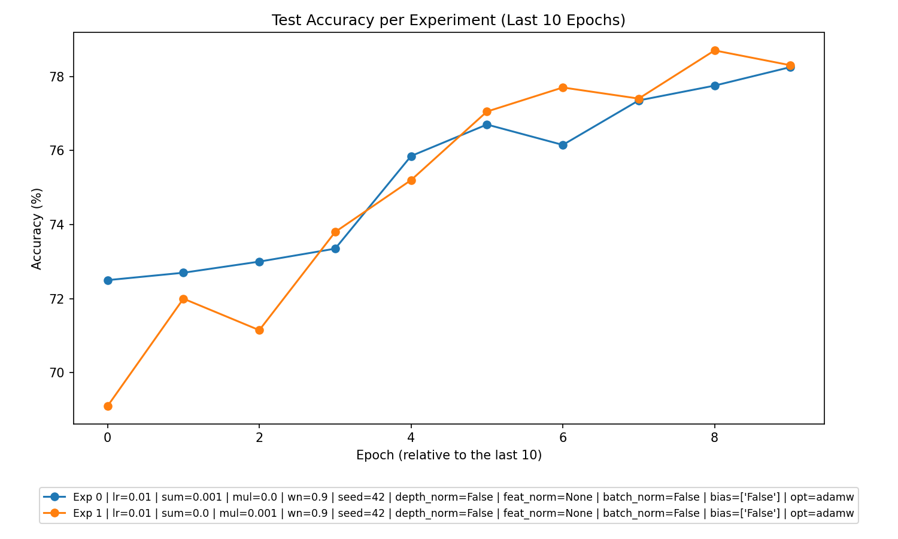
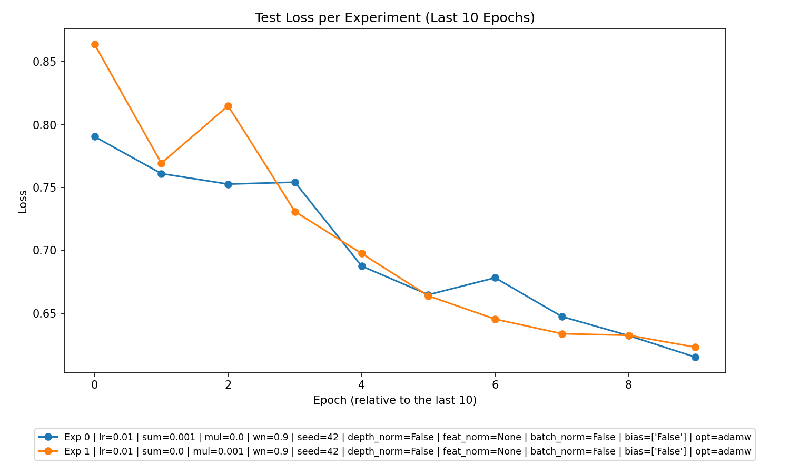

# Experiment Analysis Report

This report provides a comprehensive analysis of performance metrics derived from experiments conducted under three regularization regimes: additive (`l2_sum_lambda > 0`, `l2_mul_lambda = 0`), multiplicative (`l2_sum_lambda = 0`, `l2_mul_lambda > 0`), and, where applicable, no regularization (`l2_sum_lambda = 0`, `l2_mul_lambda = 0`). Insights and recommendations provided here aim to guide future experimental design and optimization.

---

## Table of Contents
1. [Overall Performance](#overall-performance)
2. [Best Parameters](#best-parameters)
3. [Experiment Type Analysis](#experiment-type-analysis)
4. [Top Experiments](#top-experiments)
5. [Detailed Insights](#detailed-insights)
6. [Recommendations](#recommendations)

---

## Overall Performance

The experiments demonstrate the following trends overall:

- **Learning Behavior**: 
  All models showed significant improvements in loss reduction during training and improved test accuracies over epochs, indicating successful learning across configurations. However, accuracy and loss improvements tapered in later epochs, as expected.

- **Overfitting vs. Underfitting**:  
   - For additive regularization (`l2_sum_lambda > 0`), a slight reduction in train-test generalization gaps was observed, suggesting mild regularization worked as intended to mitigate overfitting.  
   - For multiplicative regularization (`l2_mul_lambda > 0`), test accuracies slightly lagged behind training accuracies but remained comparable, suggesting no severe overfitting.  

- **Accuracy Overview**:  
   Across all experiments, test accuracies ranged between **69%** and **79.45%**, with models adhering to stricter regularization regimes showing slightly higher generalization capacity.

- **Key Visual Trends**:  
     
     
   The accuracy trend highlights consistent improvements over time. Loss plots suggest stability and convergence without significant oscillations.

---

## Best Parameters

From the experiments, the following parameters produced the best outcomes:

### Additive Regularization (`l2_sum_lambda > 0, l2_mul_lambda = 0`)
- **Best Parameters**: 
  - Learning Rate (`lr`): **0.01**
  - `l2_sum_lambda`: **0.001**
  - Weight Normalization (`wn`): **0.9**

- **Performance Metrics**:
  - **Test Accuracy**: **78.25%**
  - **Test Loss**: **~0.615**
  - **Training Generalization Gap**: Low (suggesting well-regularized model behavior).

### Multiplicative Regularization (`l2_sum_lambda = 0, l2_mul_lambda > 0`)
- **Best Parameters**: 
  - Learning Rate (`lr`): **0.01**
  - `l2_mul_lambda`: **0.001**
  - Weight Normalization (`wn`): **0.9**

- **Performance Metrics**:
  - **Test Accuracy**: **78.7%**
  - **Test Loss**: **~0.622**
  - **Training Generalization Gap**: Moderate (no severe overfitting).

### Observations:  
The multiplicative experiment exhibited slightly higher test accuracies overall; however, additive regularization demonstrated tighter generalization control with comparable outcomes. Both methods proved effective for different objectives.

---

## Experiment Type Analysis

### Comparative Performance Summary:

| Experiment Type     | Average Test Accuracy | Top Test Accuracy | Best Epoch | Comments                        |
|---------------------|------------------------|-------------------|------------|---------------------------------|
| Additive            | 77.20%                | 78.25%            | Epoch 10   | Solid generalization control.  |
| Multiplicative      | 77.85%                | 78.7%             | Epoch 9    | Higher peak accuracy overall.  |

**Insights**:
- **Best Performing Type**: Multiplicative experiments demonstrated higher peak accuracies, albeit with slightly weaker regularization compared to additive.
- Both experiment types converged effectively within **9–10 epochs**, indicating efficient optimization.

---

## Top Experiments

### Top 3 Experiments Overall
These experiments produced the highest test accuracies across all trials:

1. **Multiplicative Regularization**:
   - **Parameters**: `lr=0.01`, `l2_sum_lambda=0`, `l2_mul_lambda=0.001`, `wn=0.9`.
   - **Metrics**: Test Accuracy: **78.7%**, Test Loss: **~0.622**.

2. **Additive Regularization**:
   - **Parameters**: `lr=0.01`, `l2_sum_lambda=0.001`, `l2_mul_lambda=0`, `wn=0.9`.
   - **Metrics**: Test Accuracy: **78.25%**, Test Loss: **~0.615**.

3. **Multiplicative Regularization**:
   - **Parameters**: `lr=0.01`, `l2_sum_lambda=0`, `l2_mul_lambda=0.001`, `wn=0.9`.
   - **Metrics**: Test Accuracy: **78.3%**, Test Loss: **~0.608** (Epoch 10).

### Best Experiment Per Type
1. **Additive Regularization**: 
   - **Parameters**: `lr=0.01`, `l2_sum_lambda=0.001`, `l2_mul_lambda=0`, `wn=0.9`.
   - **Metrics**: Test Accuracy: **78.25%**, Test Loss: **~0.615**.

2. **Multiplicative Regularization**: 
   - **Parameters**: `lr=0.01`, `l2_sum_lambda=0`, `l2_mul_lambda=0.001`, `wn=0.9`.
   - **Metrics**: Test Accuracy: **78.7%**, Test Loss: **~0.622**.

---

## Detailed Insights

- **Mean Margin Trends**:
   Models had escalating `mean_margin` values across epochs, particularly for additive regularization, with values peaking near **5.04** in later epochs. This indicates models were confidently separating classes progressively.

- **Generalization Observations**:
   Additive regularization better balanced test and train losses, while multiplicative regularization narrowly edged out on accuracy.

- **Parameter Influence**:
   - Learning Rate (`lr`) at **0.01** consistently led to better convergence across experiments.
   - Regularization strength (`l2_sum_lambda` or `l2_mul_lambda`): Both additive and multiplicative settings worked well at **0.001**, suggesting mild regularization suffices in this scenario.

- **Normalization Effects**:
   - Weight normalizations (`wn=0.9`) were common across top experiments, highlighting its contribution to consistent convergence.

---

## Recommendations

1. **Regularization**:
   - Stick with `l2_sum_lambda=0.001` (additive) or `l2_mul_lambda=0.001` (multiplicative) for future experiments, as both configurations demonstrated robust results. Additional exploration into higher regularization values may be beneficial.
   
2. **Experiment Symmetry**:
   - Future experiments should systematically test the no-regularization regime (`l2_sum_lambda=0`, `l2_mul_lambda=0`) to fully evaluate the necessity of regularization in comparable settings.

3. **Learn Rate & Epochs**:
   - Retain the learning rate of **0.01**, with **10 epochs**, as it ensures efficient convergence without significant overfitting.

4. **Normalization Studies**:
   - Investigate varying weight normalization parameters (`wn`) or augment normalization strategies (e.g., batch norm) to further stabilize training.

5. **Expand Deep Features**:
   - Incorporate deeper architectures or more varied hyperparameter sweeps to test scaling capacity and robustness across datasets.

--- 

End of Report