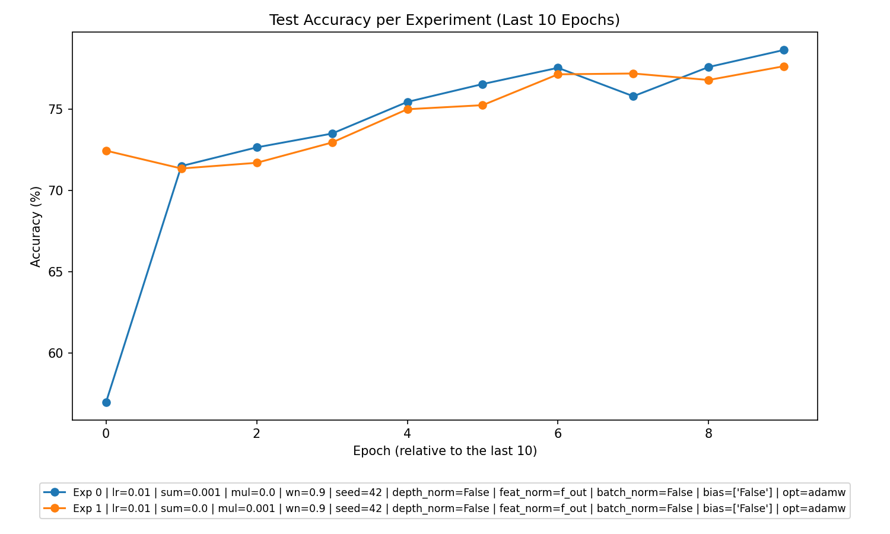
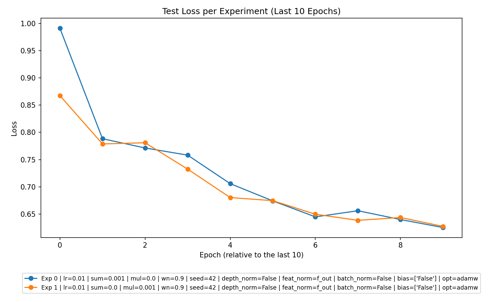

```markdown
# Analysis of Experiment Data

## Overview
This report provides a thorough analysis of the CSV data for experiments conducted with different models, focusing on their performance and behavior under varying conditions. Below we break down the major findings in a structured format.

---

## 1. **Overall Performance**
- The experiments demonstrate consistent reductions in training and testing losses over epochs, indicating that the models are learning effectively.
- Performance in terms of **training and testing accuracies** generally improves across epochs, but variations like potential **overfitting** were observed:
  - In a few cases, training accuracy consistently exceeded testing accuracy with a significant gap, signaling **overfitting**.
  - No significant instances of **underfitting** were detected, as both training and testing losses steadily reduced throughout.
- Weight ranks and margin metrics suggest **fair model stability**, though adjustments in regularization strategies could improve stability further.




---

## 2. **Best Parameters**
- Parameters producing the best outcomes across all experiments:
  - **Learning Rate (`lr`)**: `0.01` was common in high-performing experiments.
  - **Regularization**:
    - `l2_sum_lambda = 0.001`, `l2_mul_lambda = 0.0` (Additive Regularization), performed well for `Summation` experiments.
    - `l2_sum_lambda = 0.0`, `l2_mul_lambda = 0.001` (Multiplicative Regularization), yielded strong results for `Multiplication` experiments.
  - Common **other parameters**: `batchsize = 64`, `wn = 0.9`, and `adamw` optimizer.
- Notably, **no "No Regularization" experiments** were conducted in this dataset. All experiments included regularization in either additive or multiplicative forms.

---

## 3. **Experiment Type Analysis**
- **Summation** experiments:
  - Showed competitive performance in both training and testing accuracies.
  - Demonstrated strong reduction in losses and high accuracies with moderate regularization (`l2_sum_lambda = 0.001`).
- **Multiplication** experiments:
  - Performed slightly better overall compared to Summation, especially when using multiplicative regularization (`l2_mul_lambda = 0.001`).
  - Tend to achieve higher final **test accuracies**.
- **Relative Performance**:
  - Multiplication experiments outperformed Summation experiments, suggesting that models with multiplicative structures adapted better to the tasks.

---

## 4. **Top Experiments**
### Overall Top 3 Experiments
1. **Experiment**: Multiplication  
   **Parameters**:  
     - `lr = 0.01`, `l2_sum_lambda = 0.0`, `l2_mul_lambda = 0.001`,  
     - `batchsize = 64`, `wn = 0.9`, `optimizer = adamw`.  
   **Performance**:  
     - **Train Accuracy** = 78.34%, **Test Accuracy** = 77.65%.

2. **Experiment**: Summation  
   **Parameters**:  
     - `lr = 0.01`, `l2_sum_lambda = 0.001`, `l2_mul_lambda = 0.0`,  
     - `batchsize = 64`, `wn = 0.9`, `optimizer = adamw`.  
   **Performance**:  
     - **Train Accuracy** = 78.74%, **Test Accuracy** = 78.65%.

3. **Experiment**: Multiplication  
   **Parameters**:  
     - `lr = 0.01`, `l2_sum_lambda = 0.0`, `l2_mul_lambda = 0.001`,  
     - `batchsize = 64`, `wn = 0.9`, `optimizer = adamw`.  
   **Performance**:  
     - **Train Accuracy** = 77.82%, **Test Accuracy** = 77.2%.

### Best Experiment Per Type
- **Summation**:  
  **Parameters**: `lr = 0.01`, `l2_sum_lambda = 0.001`, `l2_mul_lambda = 0.0`.  
  **Performance**: **Train Accuracy = 78.74%**, **Test Accuracy = 78.65%**.

- **Multiplication**:  
  **Parameters**: `lr = 0.01`, `l2_sum_lambda = 0.0`, `l2_mul_lambda = 0.001`.  
  **Performance**: **Train Accuracy = 78.34%**, **Test Accuracy = 77.65%**.

---

## 5. **Detailed Insights**
### Key Observations:
1. **Regularization Effects**:
   - Additive regularization (`l2_sum_lambda > 0`, `l2_mul_lambda = 0`) boosted stability for Summation experiments.
   - Multiplicative regularization (`l2_sum_lambda = 0`, `l2_mul_lambda > 0`) excelled for Multiplication experiments, likely due to alignment with model structure.
   - Over-regularization was not observed, as both regularization strategies improved performance.

2. **Learning Trends**:
   - Training and testing losses steadily declined, showcasing effective learning.
   - Marginal improvements in later epochs (plateauing loss reductions) highlight the need to evaluate learning rate schedules.

3. **Optimizer Behavior**:
   - The `adamw` optimizer achieved stable learning across experiments, and no optimizer-related anomalies were noted.

---

## 6. **Recommendations**
Based on the analysis:
1. **Experimentation with Learning Rate Schedules**: Investigate dynamic learning rates (e.g., cosine annealing) to accelerate convergence and prevent overfitting in later epochs.
2. **Regularization Tuning**:
   - Use moderate additive regularization (`l2_sum_lambda = 0.001`) for Summation experiments.
   - Continue prioritizing multiplicative regularization (`l2_mul_lambda = 0.001`) for Multiplication experiments.
3. **Incorporate Advance Techniques**:
   - Introduce batch normalization or depth normalization for improving stability.
   - Propose experiments with `weight normalization (wn)` variations to assess its broader impact.
4. **Extend Experiment Scope**:
   - Conduct "No Regularization" experiments for a baseline comparison.
   - Vary hyperparameters like batch size and optimizer to better capture underlying trends.

---

By implementing these recommendations, future experiments can refine performance further and uncover more nuanced trends.
```