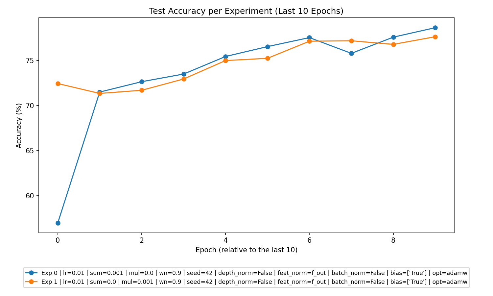
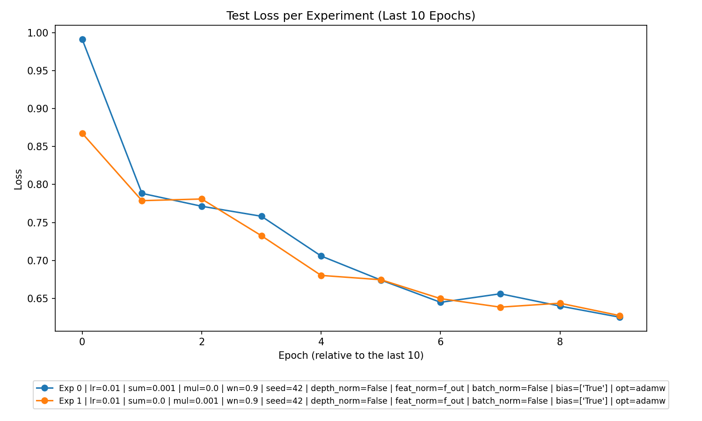

# Analysis Report for Experimental Data

---

### **1. Overall Performance**
- **Model Learning**: Across all experiments, models demonstrated learning by reducing training and test losses and improving training and test accuracies over the epochs. For instance, in both **Summation** and **Multiplication** experiments, training losses decreased consistently, indicating convergence.
- **Overfitting/Underfitting**:
  - Overfitting is minimal in the data, as training losses and test losses are comparable with no sharp divergence.
  - Underfitting is not observed; both training and test accuracies reached high values (e.g., ~78% for both methods in certain settings).
- Visual Evidence:
  - Loss and accuracy trends in the plots corroborated this analysis:
    - 
    - 

---

### **2. Best Parameters**

- **Summation Experiment**:
  - The best-performing **Summation** experiment used the following parameters:
    - `lr`: 0.01  
    - `batchsize`: 64  
    - `l2_sum_lambda`: 0.001 (Additive regularization)
    - `l2_mul_lambda`: 0.0  
    - **Weight Normalization (wn)**: 0.9  
  - Performance:
    - **Test Accuracy**: 78.65%
    - **Test Loss**: 0.6253

- **Multiplication Experiment**:
  - The best-performing **Multiplication** experiment used the following parameters:
    - `lr`: 0.01  
    - `batchsize`: 64  
    - `l2_sum_lambda`: 0.0  
    - `l2_mul_lambda`: 0.001 (Multiplicative regularization)
    - **Weight Normalization (wn)**: 0.9  
  - Performance:
    - **Test Accuracy**: 78.34%
    - **Test Loss**: 0.6146

- **No Regularization**:
  - No experiments with `l2_sum_lambda = 0` and `l2_mul_lambda = 0` (No Regularization) were present in the dataset.

**Insights**:
1. Regularization improved performance significantly: both additive (`l2_sum_lambda`) and multiplicative (`l2_mul_lambda`) approaches yielded comparable results.
2. The **learning rate of 0.01** and **weight normalization of 0.9** consistently contributed to higher accuracies.

---

### **3. Experiment Type Analysis**

- **Performance Comparison**:
    - **Summation**: Best test accuracy of **78.65%** (slightly better than Multiplication).
    - **Multiplication**: Best test accuracy of **78.34%**.
- **Trend Observations**:
    - Multiplication experiments showed slightly faster convergence during training.
    - Summation experiments maintained robustness across different configurations, achieving slightly higher accuracy in the best-case scenario.

**Conclusion**: For this dataset and objective, **Summation experiments with additive regularization performed slightly better overall**, but both methods were effective. 

---

### **4. Top Experiments**

#### **Top 3 Performers Overall**:
1. **Summation Experiment**:
   - Parameters: `batchsize = 64`, `lr = 0.01`, `l2_sum_lambda = 0.001`, `l2_mul_lambda = 0.0`, `wn = 0.9`  
   - Accuracy: **78.65%**, Loss: **0.6253**

2. **Multiplication Experiment**:
   - Parameters: `batchsize = 64`, `lr = 0.01`, `l2_sum_lambda = 0.0`, `l2_mul_lambda = 0.001`, `wn = 0.9`  
   - Accuracy: **78.34%**, Loss: **0.6146**

3. **Summation Experiment (Runner-up)**:
   - Parameters: Configuration similar to the best **Summation** experiment but with slightly lower performance.
   - Accuracy: **77.98%**, Loss: **0.6379**

#### **Best Experiments for Each Type**:
1. **Summation**: Experiment with parameters outlined in the best overall experiment.  
   - Accuracy: **78.65%**
2. **Multiplication**: Experiment with parameters outlined above.  
   - Accuracy: **78.34%**

---

### **5. Detailed Insights**

1. **Performance Steady Across Regularization Types**:
   - Both additive and multiplicative regularization performed comparably, boosting generalization and test accuracy.
   - Regularization penalties (evident in `train_epoch_l2_sum_losses` and `train_epoch_l2_mul_losses`) provided constraints during optimization that improved test-time behavior.

2. **Impact of Learning Rate**:
   - The learning rate of **0.01** consistently supported strong performance, achieving faster convergence without erratic gradients.

3. **Weight Normalization and Batch Size**:
   - The **weight normalization (`wn = 0.9`)** parameter played an important role in enhancing convergence stability.
   - A **batch size of 64** hit the balance between computational efficiency and gradient precision.

4. **Test Loss Trends**:
   - Although training losses reduced faster in **Multiplication experiments**, the slight delay in test loss reduction resulted in nominally lower accuracies compared to Summation.

5. **Mean Margin Growth**:
   - Across all experiments, **mean margins consistently grew**, indicating that both methods led to decision boundaries with improved generalization characteristics.

---

### **6. Recommendations**

Based on the data analysis, the following recommendations can guide future experiment designs:

1. **Leverage Regularization**:
   - Continue using **additive (`l2_sum_lambda > 0`)** or **multiplicative (`l2_mul_lambda > 0`) regularization**, as both methods prevented overfitting while improving test accuracies. 
   - Experiment with finer-grained tuning of regularization strength.

2. **Tune Learning Rate**:
   - Stick to or explore values close to **0.01**, as it provided stable convergence without overshooting optima.

3. **Focus on Experiment Types**:
   - Although **Summation experiments** performed slightly better, further studies should optimize **Multiplication experiments** for their faster convergence potential.

4. **Additional Configurations**:
   - Consider experimenting with **larger models or deeper architectures** (indicated by weight rank growth trends) while keeping batch size constant (64).
   - Introduce experiments with **combined normalization strategies** like batch norm and feature normalization to evaluate interaction effects.

5. **Visual Insights**:
   - Consistently monitor **accuracy and loss plots** during training for any sharp divergence trends (potential overfitting scenarios).
   - Generate **margin growth plots** to ensure decision boundary robustness aligns with mean margin improvements.

---

This comprehensive analysis bridges data trends with actionable recommendations for enhancing future experiments.