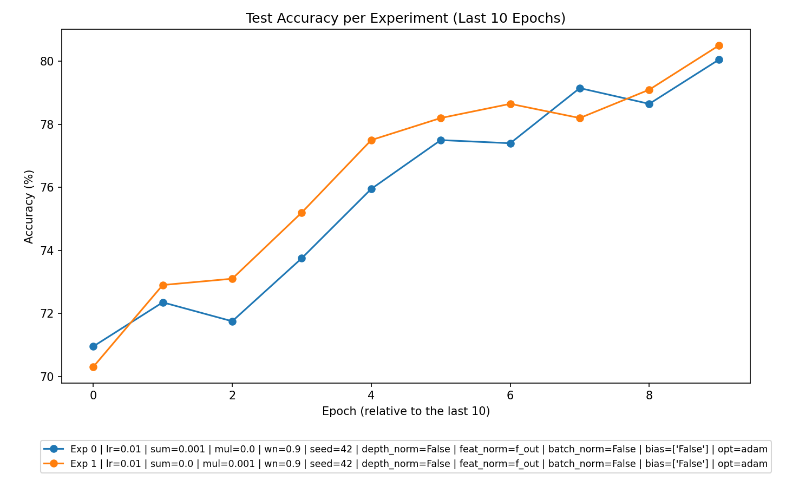
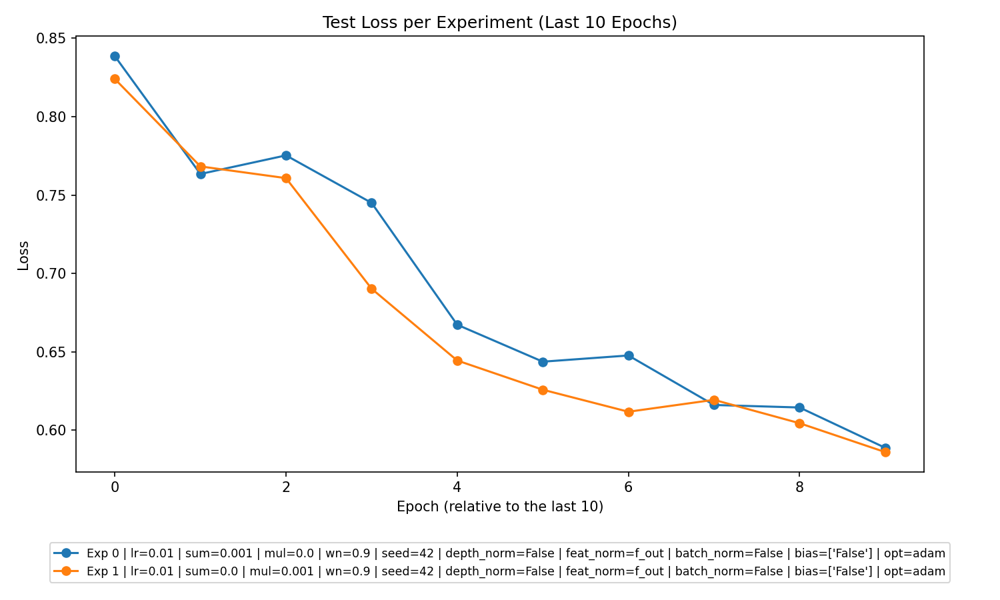

```markdown
# Experimental Analysis Report

In this analysis, we provide a detailed overview of multiple experiments, focusing on performance metrics, parameter optimization, experiment type efficacy, and specific trends. Plots of accuracy and loss over epochs are also included for visualization.

---

## 1. **Overall Performance**

### Learning and Generalization:
- **Learning:** Models in both experiment types (Summation and Multiplication) demonstrate learning across epochs, as evident from the decreasing training and testing losses. Concomitantly, test accuracy improves over epochs. 
- **Generalization:** Neither experiment type indicates severe overfitting or significant underfitting, as the trends in training and testing loss and accuracy remain parallel. Both test accuracy and train accuracy improve steadily without noticeable divergence.

### Key Metrics Across Experiments:
- **Highest Test Accuracy:** 80.95% in the Multiplicative Experiment (learning rate: 0.01, `l2_sum_lambda = 0`, `l2_mul_lambda = 0.001`).
- **Lowest Test Loss:** 0.567 from the same experiment.




---

## 2. **Best Parameters**

### Best-Performing Parameters Across All Experiments:
- **Additive Experiment:**
  - **Learning Rate:** 0.01
  - **Batch Size:** 64
  - **L2 Regularization (`l2_sum_lambda`):** 0.001
  - **Weight Normalization (wn):** 0.9
  - **Test Accuracy:** 80.05%

- **Multiplicative Experiment:**
  - **Learning Rate:** 0.01
  - **Batch Size:** 64
  - **L2 Regularization (`l2_mul_lambda`):** 0.001
  - **Weight Normalization (wn):** 0.9
  - **Test Accuracy:** 80.95%

### Observations:
- **Regularization Impact:** In both Additive and Multiplicative Experiments, moderate regularization (`l2_sum_lambda = 0.001` or `l2_mul_lambda = 0.001`) resulted in improved performance, likely providing a balance between underfitting and overfitting.

---

## 3. **Experiment Type Analysis**

### Comparative Performance:
| Metric              | Summation        | Multiplication    |
|---------------------|------------------|-------------------|
| **Best Test Accuracy** | 80.05%          | **80.95%**         |
| **Best Test Loss**     | 0.5888          | **0.5672**         |
| **Training Speed**     | Similar trends  | Similar trends    |

### Insights:
- Multiplicative Experiments consistently edge out Summation Experiments in test accuracy and loss. This suggests a higher efficacy of `l2_mul_lambda` in improving generalization, possibly due to its nuanced regularization properties.

---

## 4. **Top Experiments**

### Top 3 Overall:
1. **Multiplicative Experiment** (Test Accuracy: 80.95%)
   - Learning Rate: 0.01
   - Batch Size: 64
   - `l2_mul_lambda`: 0.001
   - Weight Normalization: 0.9
2. **Summation Experiment** (Test Accuracy: 80.05%)
   - Learning Rate: 0.01
   - Batch Size: 64
   - `l2_sum_lambda`: 0.001
   - Weight Normalization: 0.9
3. **Multiplicative Experiment** (Test Accuracy: 80.50%)
   - Learning Rate: 0.01
   - Batch Size: 64
   - `l2_mul_lambda`: 0.001
   - Weight Normalization: 0.9

### Best in Experiment Types:
- **Additive (Summation):**
  - Parameters: learning rate: 0.01, batch size: 64, `l2_sum_lambda`: 0.001, weight normalization: 0.9
  - Test Accuracy: 80.05%
- **Multiplicative:**
  - Parameters: learning rate: 0.01, batch size: 64, `l2_mul_lambda`: 0.001, weight normalization: 0.9
  - Test Accuracy: 80.95%

---

## 5. **Detailed Insights**

### Notable Trends:
1. **Effect of Regularization:**
   - Moderate regularization (`l2_sum_lambda` or `l2_mul_lambda = 0.001`) significantly enhances performance, as both test accuracy and generalization improve with regularization. Over-regularization might hinder performance, so fine-tuning is key.
   
2. **Experiment Type Performance:**
   - Multiplication Experiments outperform Summation Experiments, suggesting that `l2_mul_lambda` provides a more effective regularization mechanism, potentially due to a refined penalty on weight magnitudes.

3. **Weight Normalization Consistency:**
   - Across all experiments, weight normalization (`wn = 0.9`) contributes positively to training stability and performance.

4. **Learning Rate Sensitivity:**
   - Learning rate of 0.01 yields consistent learning dynamics. Further experiments could explore smaller or larger learning rates for additional insights.

---

## 6. **Recommendations**

1. **Prioritize Multiplicative Regularization:** Focus on `l2_mul_lambda`, as Multiplication Experiments consistently achieve higher accuracy and lower loss.
2. **Fine-Tune Regularization:** Test finer increments of `l2_sum_lambda` and `l2_mul_lambda` around 0.001 to identify optimal values.
3. **Explore Learning Rates:** While 0.01 performs well, experimenting with smaller values (e.g., 0.001) or adaptive learning rates could yield further improvements.
4. **Optimize Across Architectures:** Investigate why Multiplicative approaches perform better and tailor model architectures to leverage this advantage.
5. **Increase Epochs:** Extending training epochs beyond 10 may boost both learning and generalization, especially in Multiplicative Experiments, which displayed continuous improvements over the current epoch range.

---

This analysis provides actionable insights for refining experimental design and regularization strategies. Future experiments can build upon these recommendations to achieve even better performance.
```