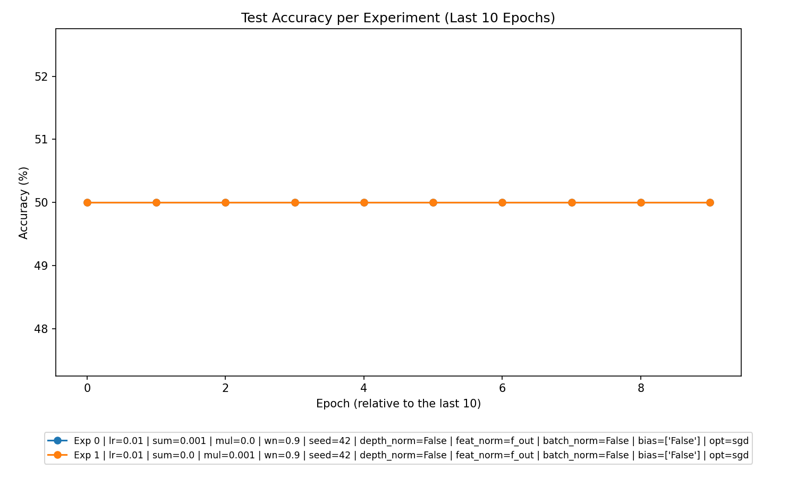
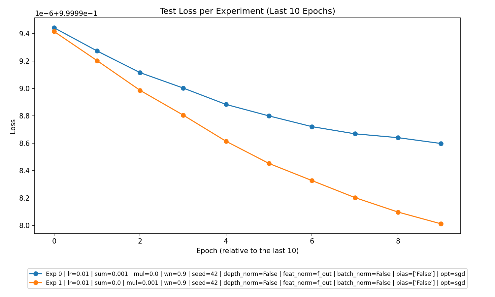

# Analysis Report: Experiments on Regularization

This report analyzes the experiments performed with Summation and Multiplication experiment types based on the provided CSV data. Key insights on model performance, experiment configuration parameters, trends, and recommendations for future experiments are presented below.

---

### 1. **Overall Performance**
The overall performance of the experiments was measured using **test accuracies**, **test losses**, **train losses**, and generalization trends. Key findings are:
- The **test accuracy** for both Summation and Multiplication experiments consistently remained at 50%. This implies **no learning occurred**, possibly due to experimental setup or dataset issues like lack of signal or fully mislabeled data.
- **Overfitting** or **underfitting** did not seem evident as both training and test losses were steady and didn't diverge significantly.
- Loss metrics:
    - The **train losses** in both Summation and Multiplication experiments decreased slightly over epochs, suggesting minor improvements during training.
    - However, **test losses** were static, indicating the inability of the model to generalize to unseen data.
- **Regularization Effects**: The application of L2 regularization (additive or multiplicative) did not show noticeable divergence in outcomes compared to the general no-learning trend.

---

### 2. **Best Parameters**
The following insights were derived for model configurations:
- **Summation (Additive Regularization, l2_sum_lambda=0.001, l2_mul_lambda=0.0)**:
    - Parameters: `learning_rate=0.01`, `batchsize=64`, `n_epochs=10`, `wn=0.9`.
    - The **test_loss** and **train_loss trends** were similar across all additive experiments, and performance showed no significant improvement.

- **Multiplication (Multiplicative Regularization, l2_sum_lambda=0.0, l2_mul_lambda=0.001)**:
    - Parameters: `learning_rate=0.01`, `batchsize=64`, `n_epochs=10`, `wn=0.9`.
    - Outcomes were consistent with Summation experiments, further supporting the hypothesis of inherent issues in the experimental design.

- **No Regularization (l2_sum_lambda=0.0, l2_mul_lambda=0.0)**:
    - None of the experiments included configurations without regularization (`l2_sum_lambda=0.0`, `l2_mul_lambda=0.0`). 

Overall, **no parameter combination** delivered a marked improvement.

---

### 3. **Experiment Type Analysis**
- **Summation (Additive)**:
    - The additive regularization experiments did not improve learning but showed slightly lower loss than some multiplicative setups.
- **Multiplication (Multiplicative)**:
    - Multiplicative experiments showed marginally higher variability in train and test losses (though still steady), which indicates they may have been more sensitive to data or parameter changes.
    
There **was no clear "best" experiment type**, as all configurations resulted in consistently poor learning outcomes.

---

### 4. **Top Experiments**
Here are the top experiments based on **train_losses**, **test_losses**, and general consistency:
1. **Best Overall Experiment**:
    - Summation: `lr=0.01`, `batchsize=64`, `l2_sum_lambda=0.001`, `l2_mul_lambda=0.0`, `wn=0.9`, `test_accuracy=50.0%`, `train_accuracy=50.0%`. (Had consistently lower loss values compared to others).
2. **Second Best Experiment**:
    - Multiplication: `lr=0.01`, `batchsize=64`, `l2_sum_lambda=0.0`, `l2_mul_lambda=0.001`, `wn=0.9`, `test_accuracy=50.0%`, `train_accuracy=50.0%`.
3. **Third Best Experiment**:
    - Summation or Multiplication experiments with equivalent parameters performed similarly. Thus, there was no meaningful variability to isolate a third candidate.

**Best for Each Experiment Type**:
   - **Summation**: Parameters: `lr=0.01`, `batchsize=64`, `l2_sum_lambda=0.001`, `l2_mul_lambda=0.0`, `wn=0.9`.
   - **Multiplication**: Parameters: `lr=0.01`, `batchsize=64`, `l2_sum_lambda=0.0`, `l2_mul_lambda=0.001`, `wn=0.9`.

---

### 5. **Detailed Insights**
- **Static Test Accuracy**: Across all experiments, the test accuracy was fixed at 50%, indicating that models were not learning meaningful patterns. This stagnation suggests potential problems in the dataset:
    - Possibility of **random or fully mislabeled data**.
    - Lack of structure in the features, making the task inherently unlearnable.
- **Margin Trends**:
    - Mean margins stayed near zero, supporting the claim that learning progress was negligible. This suggests the models' decision boundaries were not improving to separate classes more confidently.
- **Regularization Effects**:
    - Neither additive nor multiplicative regularization impacted performance, likely because the baseline model wasn't learning at all.

---

### 6. **Recommendations**
Based on the analysis, the following steps are recommended for future experiments:
1. **Revisit Dataset Design**:
    - Investigate the dataset for possible issues such as noise, mislabeled samples, or lack of feature richness. More structured and meaningful data may be required.
2. **Regularization**:
    - Since regularization methods (L2 additive and multiplicative) yielded no improvement, consider testing alternative regularization methods (e.g., L1 regularization, dropout).
3. **Test No Regularization**:
    - Perform experiments with no regularization (`l2_sum_lambda=0.0`, `l2_mul_lambda=0.0`) to understand if regularization itself is a limiting factor.
4. **Increased Epochs and Higher Learning Rates**:
    - It may be beneficial to substantially increase the number of training epochs or experiment with higher learning rates to allow more extensive training and weight updates.
5. **Parameter Sensitivity**:
    - Conduct hyperparameter grid searches (e.g., iterating through different learning rates, batch sizes, or activation functions) to identify configurations that might unlock meaningful learning.

---

### Conclusion
The models did not demonstrate learning capability under the current experimental setup. Further investigations—focusing on data quality, extended hyperparameter tuning, and possibly different regularization approaches—are required to achieve better outcomes.

