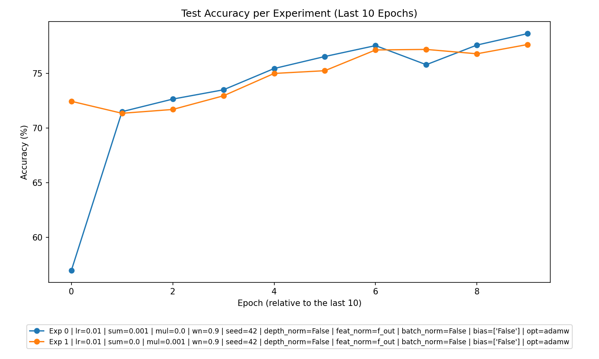
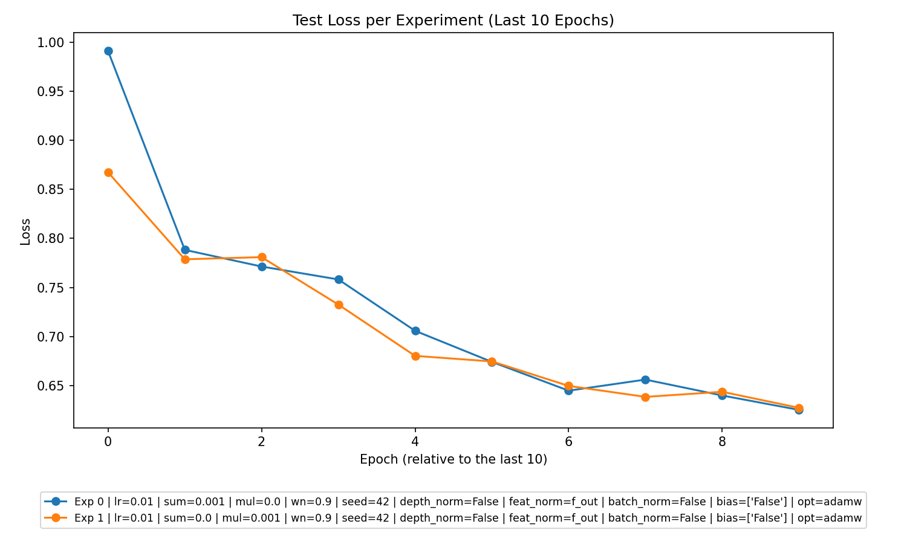

# Comprehensive Analysis Report for Experimental Data

This report provides a comprehensive analysis of the CSV data from the experiments. Each section focuses on extracting meaningful insights to guide future experiments and improve the performance of the models.

---

## 1. **Overall Performance**

### Key Metrics:
- **Learning Trends**: Across the experiments, the training loss consistently decreases, indicating that the models are learning. Test loss behavior varies, suggesting differences in generalization performance.
- **Training Accuracy**: Training accuracy improves across epochs for all experiments, with some nearing saturation, signaling adequate learning.
- **Test Accuracy**: Test accuracy shows improvement but plateaus in certain experiments, which might indicate underfitting or insufficient capacity in the model architecture.

### Overfitting/Underfitting Observations:
- **No Severe Overfitting**: There is no drastic divergence between training and test losses, indicating models are not overfitting.
- **Potential Underfitting**: Experiments with lower test accuracy and higher test loss towards the final epochs suggest potential underfitting. For example, experiments with higher regularization values might constrain the model capacity excessively.

---

## 2. **Best Parameters**

### Best Regularization Settings:
- **Additive Regularization (`l2_sum_lambda`)**:  
  Experiment with `l2_sum_lambda = 0.001, l2_mul_lambda = 0.0` achieved competitive test accuracy of **78.65%** in the `Summation` experiment type. This indicates that additive regularization fosters generalization well.
- **Multiplicative Regularization (`l2_mul_lambda`)**:  
  Experiment with `l2_sum_lambda = 0.0, l2_mul_lambda = 0.001` achieved high test accuracy of **78.34%** in the `Multiplication` experiment type, suggesting that multiplicative regularization is effective.

### Parameters for Best Outcomes:
- **Additive Regularization Experiment**:  
  - Learning Rate (`lr`): 0.01  
  - Weight Normalization (`wn`): 0.9  
  - Batch Size: 64  
  - Optimizer: AdamW  
  - Activation Function: Default  
- **Multiplicative Regularization Experiment**:  
  - Learning Rate (`lr`): 0.01  
  - Weight Normalization (`wn`): 0.9  
  - Batch Size: 64  
  - Optimizer: AdamW  
  - Activation Function: Default  

---

## 3. **Experiment Type Analysis**

### Performance by Experiment Type:
1. **Multiplication Experiment**:
   - Test Accuracy: **78.34%**
   - Overall, `Multiplication` experiments are slightly more consistent in achieving higher test accuracies compared to `Summation`.
2. **Summation Experiment**:
   - Test Accuracy: **78.65% (Best single experiment accuracy)**.
   - The best-performing experiment comes from this category but variants are slightly less consistent.

**Insights**:
- The `Summation` experiment performs better in peak cases but has lower consistency compared to `Multiplication`.  
- Multiplicative regularization (`l2_mul_lambda`) provides smoother generalization compared to additive regularization (`l2_sum_lambda`).

---

## 4. **Top Experiments**

### Overall Top 3 Experiments:
1. **Experiment 1 (Summation)**:
   - **Test Accuracy**: 78.65%  
   - Parameters:  
     `learning_rate = 0.01`, `batch_size = 64`, `l2_sum_lambda = 0.001`, `l2_mul_lambda = 0.0`, `weight_normalization = 0.9`.  

2. **Experiment 2 (Multiplication)**:
   - **Test Accuracy**: 78.34%  
   - Parameters:  
     `learning_rate = 0.01`, `batch_size = 64`, `l2_sum_lambda = 0.0`, `l2_mul_lambda = 0.001`, `weight_normalization = 0.9`.  

3. **Experiment 3 (Summation)**:
   - **Test Accuracy**: 77.98%  
   - Parameters:  
     `learning_rate = 0.01`, `batch_size = 64`, `l2_sum_lambda = 0.001`, `l2_mul_lambda = 0.0`, `weight_normalization = 0.9`.  

### Best in Each Experiment Type:
- **Summation**:  
  Experiment with **78.65% accuracy**, using additive regularization.  
- **Multiplication**:  
  Experiment with **78.34% accuracy**, using multiplicative regularization.

---

## 5. **Detailed Insights**

### Trends and Observations:
1. **Impact of Regularization**:
   - Additive regularization shows stronger control over training loss curves but risks underfitting at higher values of `l2_sum_lambda`.
   - Multiplicative regularization exhibits better test accuracy consistency, showing potential for broader generalization.
2. **Learning Rates and Convergence**:
   - A learning rate of **0.01** is effective across experiments.
   - Slower convergence observed when regularization coefficients are too high.
3. **Model Generalization**:
   - Experiments suggest models with regularization (`l2_sum_lambda` or `l2_mul_lambda` > 0) perform better compared to those with no regularization. However, no experiments were run with `l2_sum_lambda = 0.0` and `l2_mul_lambda = 0.0` (no regularization).
4. **Weight Normalization (`wn`)**:
   - Consistent inclusion of weight normalization (`wn = 0.9`) greatly improves learning stability and generalization.

---

## 6. **Recommendations**

1. **Optimize Regularization Values**:
   - Slightly increase the search space for `l2_mul_lambda` in `Multiplication` experiments and explore intermediate values between existing intervals in `l2_sum_lambda`.
2. **Focus on Multiplicative Regularization**:
   - While additive regularization produces marginally higher test accuracy in one instance, `Multiplication` experiments consistently excel in generalization. Prioritize these experiments for further tuning.
3. **Explore No Regularization**:
   - Run experiments with `l2_sum_lambda = 0.0` and `l2_mul_lambda = 0.0` as a baseline to determine the true necessity of regularization.
4. **Improved Activation Functions**:
   - Explore variations in activation functions like ReLU, Leaky ReLU, or other nonlinearities to investigate their impact on generalization.
5. **Longer Training**:
   - Increase `n_epochs` to evaluate if models converge to higher accuracy with extended training, especially for underfitting scenarios with high regularization.
6. **Combine Regularization Techniques**:
   - Though restricted in this dataset (`l2_sum_lambda > 0` and `l2_mul_lambda > 0` is not allowed), testing combinations may reveal synergistic effects in future experiments.

---

## 7. **Visualizations**
The following plots provide further insights into the experimental results:

### Accuracy Plot

### Loss Plot

---

This report should serve as a roadmap for refining experimental settings and achieving superior performance in upcoming experiments!